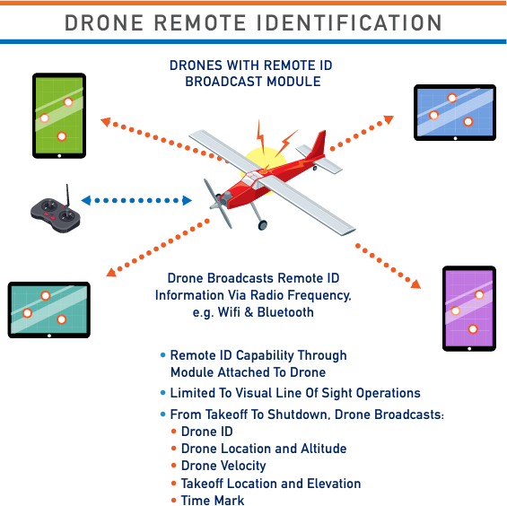
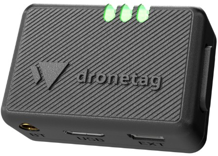
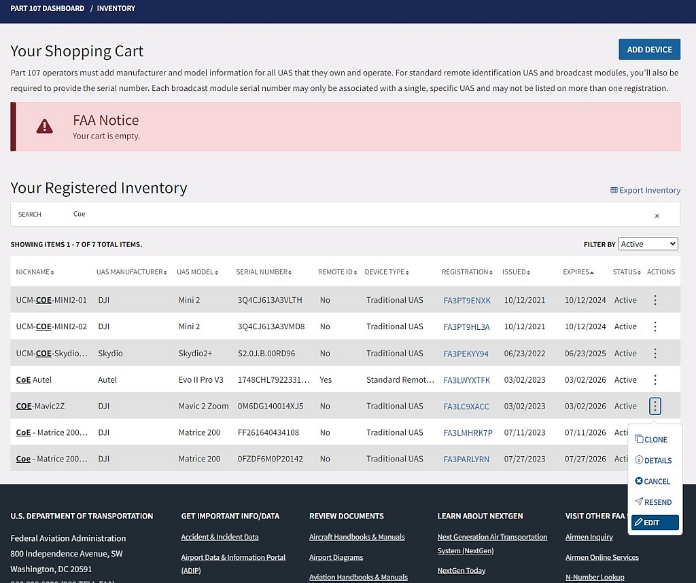
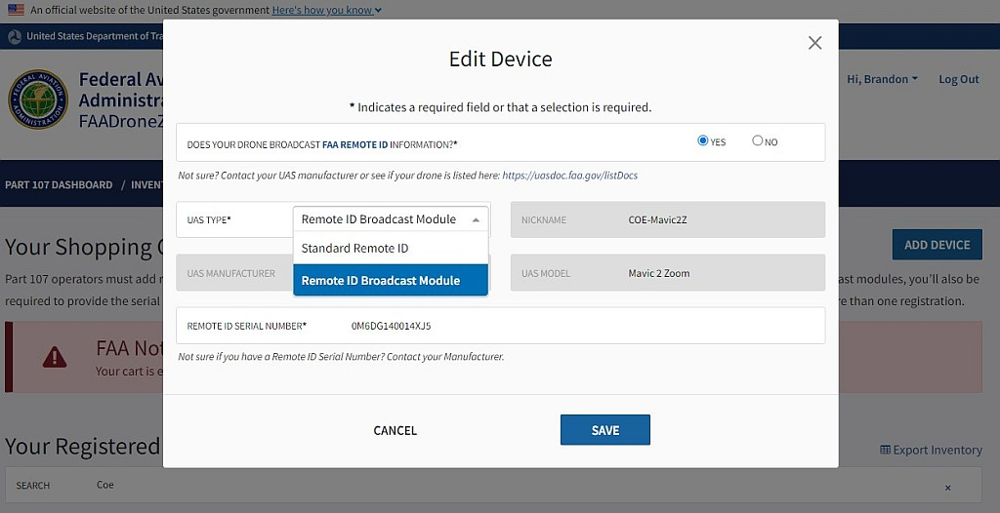
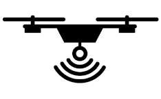

# Remote Identification
Remote Identification functionality will be required by March 16, 2024. Latest news - [FAA Extends Remote ID Enforcement Date Six Months](https://www.faa.gov/newsroom/faa-extends-remote-id-enforcement-date-six-months)

## What is Remote Identification?

Remote identification technology broadcasts information about a drone's flight, location, and operator.  This information can be picked up and viewed by anyone with the proper receiver, and is therefore public knowledge. It exists to notify nearby bystanders of a drone's presence, and to aid law enforcement with monitoring and tracking down UAS in national airspace.

For more information about Remote Identification, please visit the FAA's website [here](https://www.faa.gov/uas/getting_started/remote_id)

### Standard Remote Identification
Most drones manufactured after December 2022 have RID already built-in to the drone's firmware. Standard RID displays the drone's location, altitude and speed, as well as the location and altitude of it's operation station.

### Broadcast Remote Identification
For drones that don't have RemoteID built in, pilots must install a Remote ID broadcast module.  This is a a small and lightweight component that can be added externally to a drone.  It functions the same as standard remote identification, minus the ability to broadcast the location of the drone's operator.  Modules can only display the location of the drone's takeoff point.

[{width=300px}](https://www.faa.gov/sites/faa.gov/files/uas/getting_started/remote_id/industry/Remote_ID_Standard.pdf)
[{width=300px}](https://www.faa.gov/sites/faa.gov/files/uas/getting_started/remote_id/industry/Remote_ID_Broadcast_Module.pdf)

### FAA Recognized Identification Area (FRIA)

For drones that do not have RID capabilities, the FAA is allowing pilots to fly their drones only in FRIAs. Visit the FAA's UAS Data Delivery Service (UDDS) website to find a map of all FRIAs in the United States. Educational institutions and FAA-recognized Community Based Organizations can apply for a FRIA.

## Standard Remote ID Drones

If your drone is equipped with remote ID or has the capabilities for it, then you are operating with standard remote ID. Make sure to keep your drone's firmware up to date to receive the latest Remote ID updates. Remote ID functionality is typically seamless - simply switch on your drone and enter flight mode, and remote ID is required to automatically trigger and broadcast information up until the drone is turned off.

Some common drones with Standard Remote ID include:

- DJI Mavic 3 Series
- DJI M30 Series
- DJI Matrice 300/350 RTK
- DJI Mavic 2 Series*
- DJI Mini 3 Series
- DJI Phantom 4 RTK
- DJI Phantom 4 Pro v2.0
- Autel Evo II Pro v3
- AgEagle eBee
- Skydio 2+

A full list of Standard Remote ID drones can be found in our [Full Table of Drones](#dronelist)

*excludes Mavic 2 Enterprise Zoom/Dual

## Broadcast Remote ID Modules

Remote ID modules were created to act as a substitution for standard remote ID, specifically for older drones that are unable to comply with the new regulation. There are a few on the market, with the most popular being the Dronetag Beacon and the DroneBeacon db120. When looking for the best module to purchase, make sure to look at battery life, size of the device, and the signal's range.

Some common drones that need a Broadcast Remote ID module:

- DJI Matrice 200 Series
- DJI Phantom 4 Series
- DJI Mini 2 Series
- DJI Inspire 1/2 Series
- DJI Matrice 100 Series
- Any drone built from parts or a kit

### Available Broadcast Remote ID Modules

- **Blue Mark DroneBeacon db120** (Figure \@ref(fig:db120)) is ideal for all applications, as it has the ability to broadcast signals through Bluetooth, Wi-Fi, or both.  It is small and lightweight (25g), with a long battery life and even longer signal range. Available [here](https://dronescout.co/product/dronebeacon-db120/) for $\text{€}129$

(\#fig:db120)Blue Mark db120

- **DroneTag Beacon** (Figure \@ref(fig:dtag)) is an even lighter option at 15g, better for small drones such as the DJI Mavic series, albeit at a slightly higher cost. Available [here](https://shop.dronetag.cz/products/21-dronetag-beacon.html) for $\text{€}199$. External bluetooth antenna does provide additional range, but is functional without.

(\#fig:dtag)DroneTag Beacon

- **Spektrum SkyID** Spektrum was the pioneer in 2.4GHZ RC systems, and now they're the first to make a good RemoteID module for the average RC pilot. Just plug this into any of your servo ports on your receiver and you're good to go. Compatible with just about any RC receiver. Available [here](https://www.spektrumrc.com/product/skyid-remote-id-module/SPMA9500.html) for \$99.99.

(\#fig:skyID)Spektrum SkyID

### Updating your Registration {#update}

To complete the transition to Remote ID, all drone registrations must be updated on the FAA Drone Zone. Updating your UAS Registration is free and can be done at any time until December 31, 2023 - this date may be extended.

1. Log into FAA Drone Zone
2. From your dashboard, enter your drone inventory.  
3. Find the drone registration you want to update, and click the three vertical dots to open the menu. 
    - Select 'Edit' from the dropdown menu.
4. In the new window, when it asks 'Does your drone broadcast FAA Remote ID information?' select 'YES.'

(\#fig:ridedit)Edit your UAS Registration

5. Update your UAS TYPE - the options will change when you select 'YES'
    - Select either 'Standard Remote ID' or 'Remote ID Broadcast Module'
6. Enter in the Remote ID Serial Number
    - If your drone has Remote ID built-in (ie, Standard Remote ID), use your drone's serial number.
    - If you are adding a Remote ID Broadcast Module, use the Remote ID Broadcast Module's serial number.

(\#fig:rideupd)Update your Serial Number

## Frequently Asked Questions

1. **Can I move my Broadcast Module between drones?**

    It is not recommended as of right now.  In order to move broadcast modules between drones, you also need to update both drone's serial number and remote ID serial number in their FAA registration to document the change.  While it is currently free to do until December 2023*, afterwords it will be the equivalent of registering a new drone (\$5).

2. **I don't like Remote Identification. Do I have to comply? Will the UC do anything to me?**

    Yes, it is required by law that all airborne drones need to be equipped with RID by March 16, 2024.  If not, you may only fly your drone in a FRIA. Failure to comply with Federal Regulations is a violation of University Policy and may be subject to disciplinary actions.
    

3. **Can I turn off RID while flying in a FRIA?**

    No. If your drone has the ability to broadcast RID, it must be on at all times while the drone is in flight.
    
4. **Where can I buy a Broadcast RemoteID module?**

    We recommend: [BlueMark db120, ~$140](https://dronescout.co/product/dronebeacon-db120/) or [Dronetag Beacon, ~$220](  https://shop.dronetag.cz/products/21-dronetag-beacon.html).  Network RemoteID is not required in the US.
    
5. **Is it better to get a new drone with Standard Remote ID or get a Broadcast Remote ID module?**
    
    At this point, there is no major difference. After BVLOS regulations are published (TBD, est. 2025), only Standard RemoteID drones will be eligible for BVLOS operations. See our [table of regulations](#catDrones) for additional information.
    
6. **After I buy a Broadcast Remote ID module, is there anything I need to do?**

    Once you receive it and install it on your drone (velcro works well), edit your drone's FAA registration. See [above](#update) for instructions. Typically, no further configuration is necessary within the US. If you plan on taking this drone internationally, additional configuration may be necessary.

## Reading Remote Identification
One of the primary goals of Remote Identification is to provide information for law enforcement and other security personnel to assist in identifying aerial threats. 

Remote ID messages are relayed in two mechanisms with two versions: 

- Bluetooth 4 Legacy Advertising
- Bluetooth 5 Long Range Advertising
- WiFi Neighbor Awareness Network (NAN)
- WiFi Beacon

The mechanism in which the Remote ID message is relayed is significant to whether they may be detected.

### Mobile Devices
The intent behind Remote ID is to enable mobile devices to detect and receive messages in the field.  However, this aspect of Remote ID is underdeveloped at this point.

- Android devices can receive RID messages over Bluetooth and Wi-Fi
- iOS devices can only receive RID messages over Bluetooth

#### Available Apps
There are two apps available for reading Remote ID messages

- **OpenDroneID** - Available on [Android](https://play.google.com/store/apps/details?id=org.opendroneid.android_osm)
- **DroneScanner** - Available on [Android](https://play.google.com/store/apps/details?id=cz.dronetag.dronescanner) and [iOS](https://apps.apple.com/gr/app/drone-scanner/id1644548782)

{width=100px}
{width=100px}

#### Turn off Wi-Fi scan throttling

By default, Android versions 8.0 and above prohibit frequent scans of Wi-Fi networks. To enable high-frequency scans necessary for Remote ID, you must disable Wi-Fi scan throttling.

1. **Turn On Developer Mode** 

    - Go to "Settings"
    - Tap "About Device" or "About Phone"
    - Tap "Software Information"
    - Tap "Build number" seven (7) times.
    - Enter your pattern, PIN or password to enable the Developer options menu
    - "Developer Options" menu will now appear in your Settings Menu
    
2. **Enter Developer Options**
3. **Scroll Down to the Network category**
4. **Turn Off Wi-Fi scan throttling**

### Drone Broadcasting

Not all drones broadcast Remote ID in the same way.  The following table depicts the mechanism for common drone manufactures use for Remote ID.  

                      Bluetooth   Wi-Fi 
--------------------  ----------  ------
DJI Series            -           X     
Autel Series          X           -     
Skydio                -           X     
Cube ID (ArduPilot)   X           -     
BlueMark db120        X           X     
Dronetag Beacon       X           X     

*iOS devices are currently only able to read RemoteID messages over Bluetooth.*

